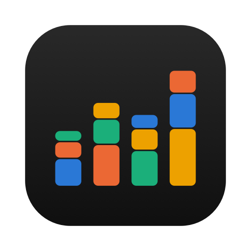
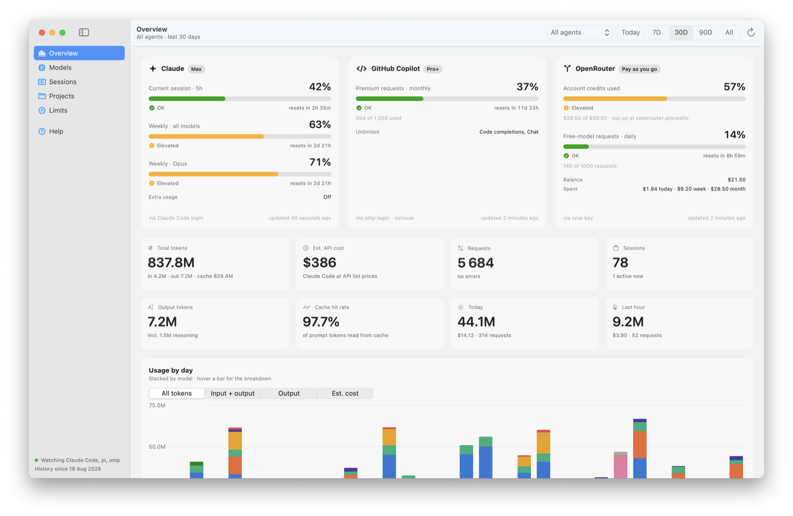
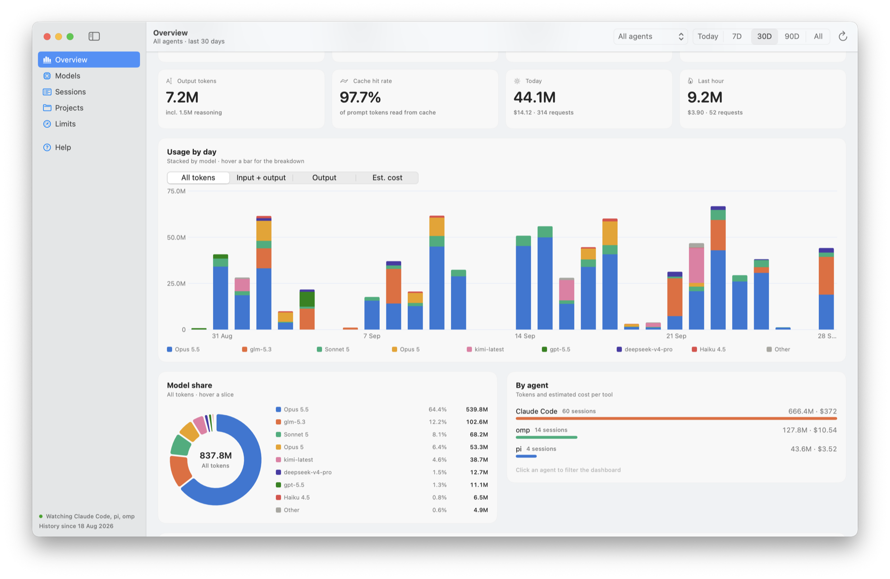
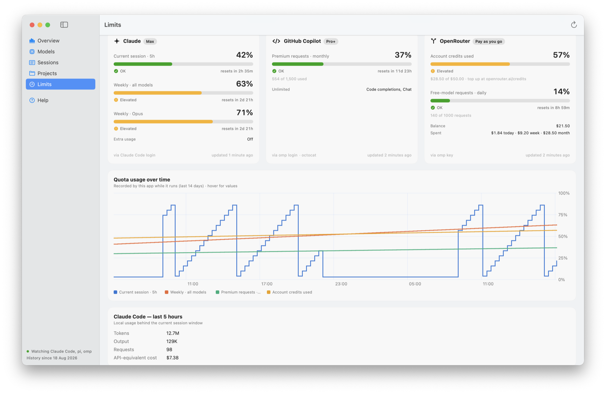
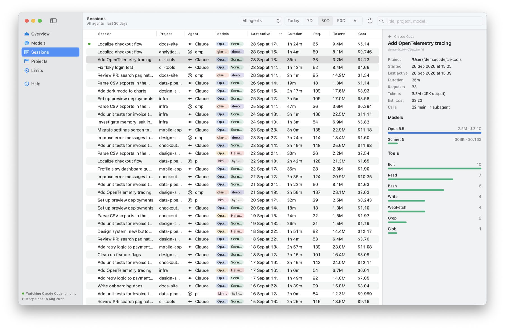
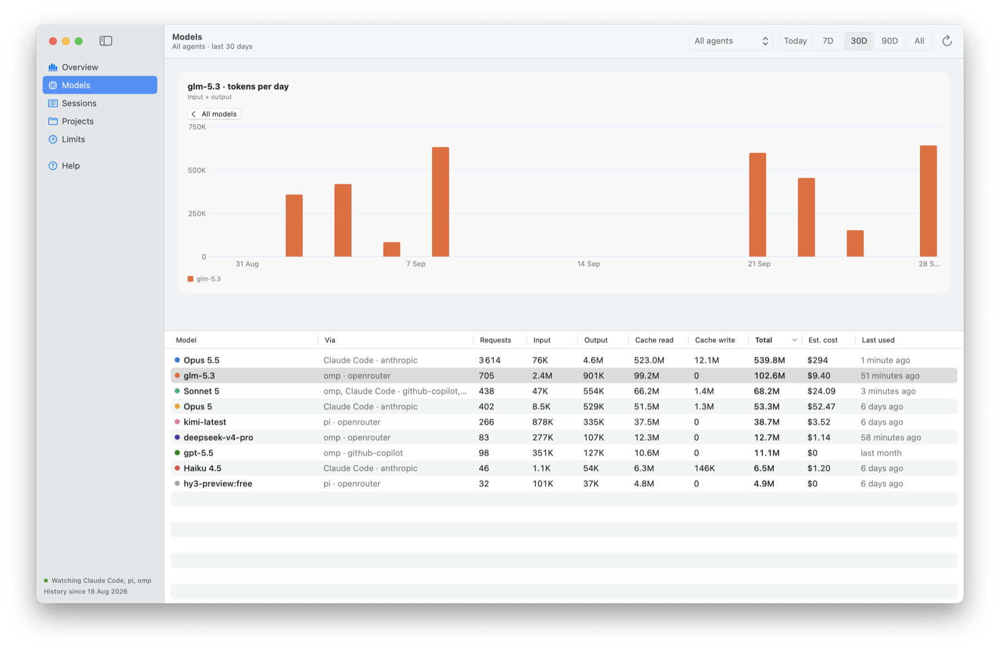
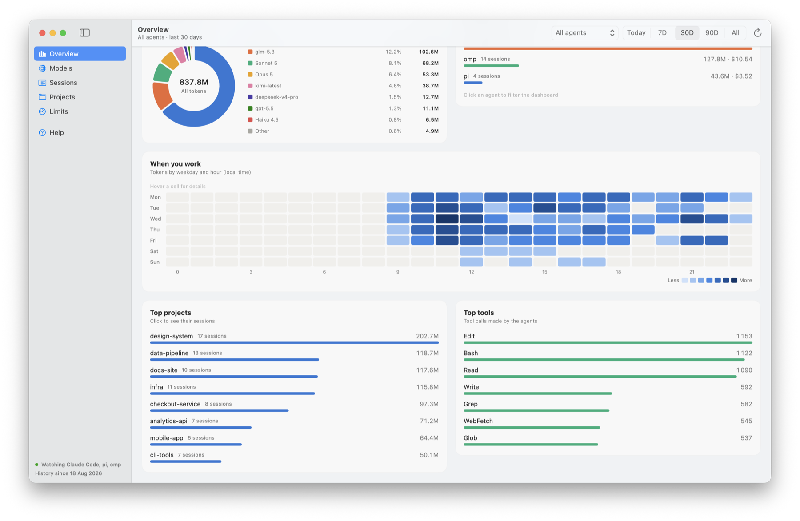
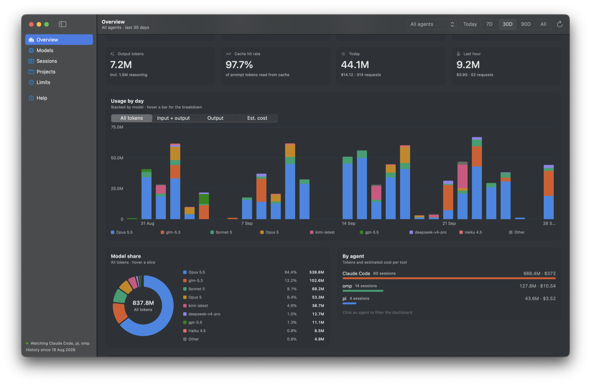
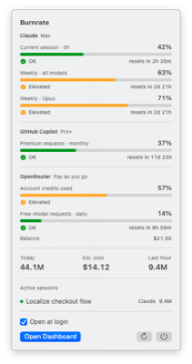
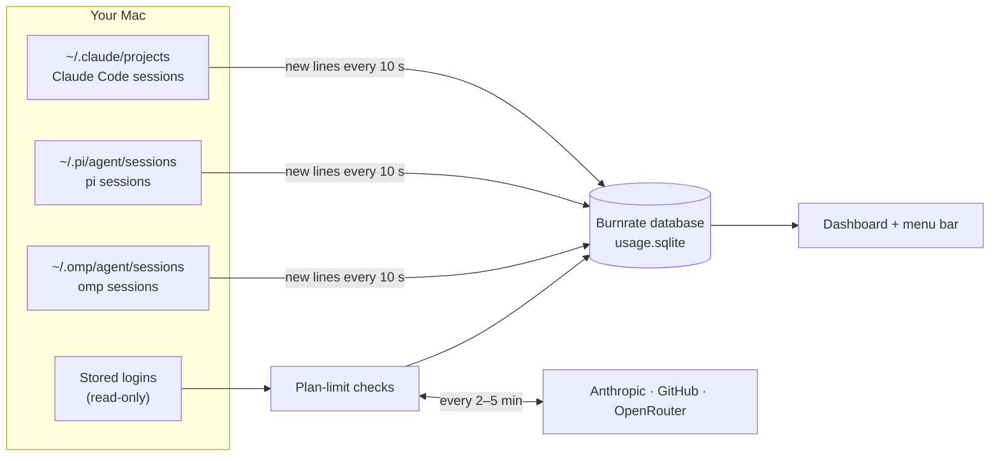

<p align="center">
  
</p>

<h1 align="center">Burnrate</h1>

<p align="center">
  <strong>See how fast you're burning through your AI coding agents.</strong><br>
  Token usage, cost and plan limits for Claude Code, pi and omp, live in your macOS menu bar.
</p>

<p align="center">
  <a href="https://github.com/oleksii-stepanenko/burnrate/releases/latest"></a>
  <a href="https://github.com/oleksii-stepanenko/burnrate/actions/workflows/release.yml"></a>
  <a href="https://github.com/oleksii-stepanenko/burnrate/releases"></a>
  
  
  <a href="#install"></a>
</p>

<p align="center">
  <a href="#install">Install</a> •
  <a href="#features">Features</a> •
  <a href="#screenshots">Screenshots</a> •
  <a href="#how-it-works">How it works</a> •
  <a href="#privacy">Privacy</a> •
  <a href="#build-from-source">Build</a>
</p>

<br>

<picture>
  <source media="(prefers-color-scheme: dark)" srcset="docs/screenshots/overview-dark.png">
  
</picture>

## Why

If you code with agents all day, the questions are always the same: *How close am I to my
5-hour limit? Which model is eating my tokens? What would this cost on the API? Is my
OpenRouter balance about to run out?*

Burnrate answers them at a glance. It reads the session logs your agents already write,
keeps a permanent history in a local database, and checks your plan limits in the
background, with no API keys to paste and nothing to configure.

## Install

```sh
brew install --cask oleksii-stepanenko/tap/burnrate
```

<details>
<summary><strong>First launch: allow the app in Privacy &amp; Security</strong></summary>
<br>

Burnrate is signed with a self-signed certificate and is **not notarized by Apple**, so the
first time you open it (and after each update) macOS blocks it:

1. Open **System Settings → Privacy & Security**
2. Scroll to **Security** and click **Open Anyway** next to Burnrate
3. Confirm with Touch ID or your password

No other permissions are needed.
</details>

Update with `brew upgrade --cask burnrate`. Uninstall with `brew uninstall --cask burnrate`,
and add `--zap` to also delete the usage history.

> [!TIP]
> Want to look around first? `open -n -a Burnrate --args --demo` runs the app on generated
> sample data. It reads nothing from your disk and makes no network calls.

## Features

- **Live plan limits in the menu bar.** Claude's 5-hour session and weekly windows
  (including per-model weekly caps), GitHub Copilot premium requests, and OpenRouter credits,
  key limits and free-model requests. Each is colour-coded, with reset countdowns.
- **Every token, per model, per day.** Input, output, cache read/write and reasoning tokens,
  stacked by model. Switch between all tokens, input + output, output only, or estimated cost.
- **Three agents, one view.** Claude Code (including sub-agents and advisor calls), pi and
  omp. Filter to one agent with a click.
- **Sessions you can inspect.** Every session, with its title, project, models, duration,
  tokens and cost. Select one for a per-model breakdown and the tools it called.
- **When and where you work.** A weekday × hour heatmap, plus top projects and top tools.
- **Cost estimates.** pi and omp report their own cost. Claude Code usage is priced at API
  list rates, a yardstick for what your subscription is worth.
- **History that outlives your logs.** Claude Code deletes transcripts after 30 days. Burnrate
  keeps everything it has read, and backfills older days from Claude Code's stats cache.
- **Quietly always on.** It starts at login in the menu bar, restarts itself if it crashes,
  and shows a Dock icon only while the dashboard is open.
- **Native and light.** SwiftUI and Swift Charts, no dependencies, light and dark mode.
  It reads only the bytes appended since the last check.

## Screenshots

<table>
  <tr>
    <td width="50%"></td>
    <td width="50%"></td>
  </tr>
  <tr>
    <td align="center"><sub><b>Usage by day and model share.</b> Hover any bar for the breakdown.</sub></td>
    <td align="center"><sub><b>Limits.</b> Every quota, plus how it moved over time.</sub></td>
  </tr>
  <tr>
    <td></td>
    <td></td>
  </tr>
  <tr>
    <td align="center"><sub><b>Sessions.</b> Select one for models, tools and cost.</sub></td>
    <td align="center"><sub><b>Models.</b> Select one to see its own daily history.</sub></td>
  </tr>
  <tr>
    <td></td>
    <td></td>
  </tr>
  <tr>
    <td align="center"><sub><b>When you work.</b> Heatmap, top projects and tools.</sub></td>
    <td align="center"><sub><b>Dark mode.</b> Every chart has its own dark palette.</sub></td>
  </tr>
</table>

<p align="center">
  <br>
  <sub><b>Menu bar.</b> All limits, today's totals and active sessions, one click away.</sub>
</p>

<sub>Screenshots use the built-in demo data (<code>--demo</code>).</sub>

## How it works



| Source | Read from | What Burnrate takes |
|---|---|---|
| **Claude Code** | `~/.claude/projects/**/*.jsonl` | Tokens per API response, including sub-agents and advisor calls on their own model |
| **Claude Code archive** | `~/.claude/stats-cache.json` | Per-day, per-model totals for days whose transcripts are already deleted |
| **pi** | `~/.pi/agent/sessions/**/*.jsonl` | Tokens and the cost pi reports |
| **omp** (oh-my-pi) | `~/.omp/agent/sessions/**/*.jsonl` | Tokens and the cost omp reports; sub-agents roll up to their parent session |
| **Claude limits** | `api.anthropic.com` with Claude Code's Keychain login | 5-hour, weekly and per-model limits, extra usage |
| **GitHub Copilot** | `api.github.com` with omp's (or pi's) Copilot login | Monthly premium requests |
| **OpenRouter** | `openrouter.ai` with every key omp and pi hold | Balance, key spend limits, free-model daily requests, spend |

### Refresh schedule

| What | Every |
|---|---|
| Session logs (only new bytes are read) | 10 s |
| Claude limits | 2 min |
| GitHub Copilot quota | 5 min |
| OpenRouter | 5 min |

<kbd>⌘</kbd> <kbd>R</kbd> refreshes everything, but hits a quota endpoint at most once every 30 s.
After errors, each provider backs off exponentially, up to 30 minutes. The Claude endpoint's
rate limit is shared with other tools that poll it, such as the oh-my-claudecode HUD. When it
says "rate limited", Burnrate uses a recent reading from that HUD's cache.

### Cost estimates

pi and omp costs are what those tools report. Claude Code doesn't log cost, so its cost is an
**API-equivalent estimate** at list prices, with 5-minute and 1-hour cache writes priced
separately and fast mode at 2×. It shows what your subscription is worth; it isn't a bill.
Prices live in [`Pricing.table`](Sources/Burnrate/Core/Models.swift) and are re-applied to all
history on every launch.

## Privacy

- **Everything stays on your Mac.** The only network calls are the plan-limit checks, to
  Anthropic, GitHub and OpenRouter.
- **No prompts, replies or file contents are stored.** Per model response, Burnrate keeps
  time, agent, session, project folder, provider, model, token counts and cost. It also keeps
  session titles, tool names, and every quota reading.
- **Credentials are only read.** Burnrate reuses the logins Claude Code, omp and pi already
  store. It never writes them, never copies them into its database, and never refreshes them,
  because refreshing would rotate the token and sign the other tool out.
- **Your history is yours.** It's a plain SQLite file at
  `~/Library/Application Support/Burnrate/usage.sqlite`. Export it to CSV from the Help page,
  or delete it with `brew uninstall --zap`.

> [!NOTE]
> Rows are never deleted, even when the source log is. Claude Code prunes transcripts after
> about 30 days, so Burnrate's database becomes your long-term record. Setting
> `cleanupPeriodDays` in `~/.claude/settings.json` keeps the transcripts themselves longer.

## Open at login

On its first run from `/Applications`, Burnrate registers a per-user launch agent through
`SMAppService`. At login it starts in the menu bar only. If it crashes, launchd restarts it;
after a normal Quit it stays closed until the next login. Turn this off from the menu bar
panel, the Help page, or **System Settings → General → Login Items**.

## Build from source

Requires macOS 14+ and Swift 5.10+ (Xcode or the Command Line Tools). No dependencies.

```sh
git clone https://github.com/oleksii-stepanenko/burnrate.git
cd burnrate
./scripts/make-app.sh --release            # → build/Burnrate.app
./scripts/make-app.sh --release --install  # also copy it to /Applications
```

### Command line

The app binary has a few flags that are handy for scripting and debugging:

```sh
B="/Applications/Burnrate.app/Contents/MacOS/Burnrate"
"$B" --dump                    # ingest, then print totals per agent and model, plus live limits
"$B" --export usage.csv        # write every usage row as CSV
open -n -a Burnrate --args --demo # run on generated sample data
```

Also available: `--page overview|models|sessions|projects|limits|help` and
`--appearance dark|light`.

### Releasing

Pushing a `v*` tag builds, signs and packages `Burnrate.dmg`, publishes a GitHub Release, and
bumps the cask in [oleksii-stepanenko/homebrew-tap](https://github.com/oleksii-stepanenko/homebrew-tap).
See [RELEASE.md](RELEASE.md).

## Troubleshooting

<details>
<summary><strong>macOS says Burnrate "cannot be opened"</strong></summary>
<br>
That's Gatekeeper, because the app isn't notarized. Allow it under <b>System Settings →
Privacy &amp; Security → Open Anyway</b>. This is needed again after each update.
</details>

<details>
<summary><strong>The Claude card says "Token expired"</strong></summary>
<br>
Burnrate never refreshes Claude Code's login. Run any Claude Code command and the card
recovers on the next check.
</details>

<details>
<summary><strong>The Claude card says "Rate limited"</strong></summary>
<br>
Another tool polled the same endpoint recently. The card keeps showing the last good
reading, uses the oh-my-claudecode HUD's cache if it has a newer one, and retries with
backoff.
</details>

<details>
<summary><strong>An agent doesn't appear</strong></summary>
<br>
Burnrate only shows agents whose session folders exist. The Help page lists every source
with a ✓ or — next to it.
</details>
